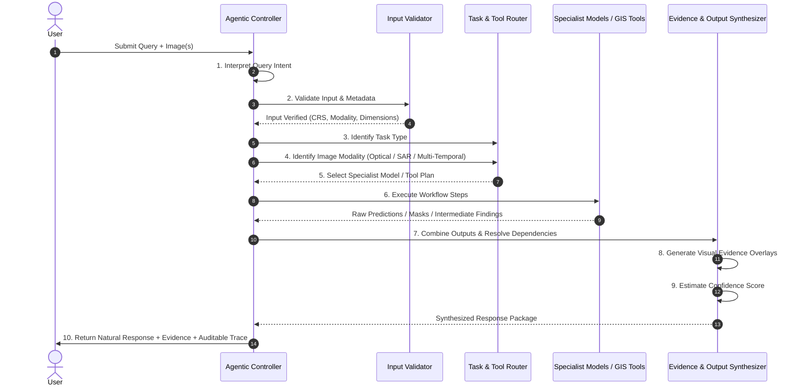

# Agentic Workflow & Reasoning Lifecycle

This document defines the 10-step agentic execution lifecycle for SatQuery AI.

---

## 🔄 The 10-Step Agentic Lifecycle

---

## 📋 Detailed Step Specifications

### Step 1: Interpret Query
- Analyze the user prompt using the agent controller.
- Extract target objects, geographical references, time horizons, and analytical operations (counting, area calculation, change comparison).

### Step 2: Validate Input
- Inspect raster metadata: spatial dimensions, band count, data type, NoData masks, projection CRS, and temporal timestamps.
- Validate that the uploaded data matches the required query intent (e.g., verifying two distinct timestamps for a change query).

### Step 3: Identify Task
- Classify query into one or more task categories:
  - Single-Image VQA
  - Text-Guided Visual Grounding
  - Dense Scene Captioning
  - Bi-Temporal Change Detection
  - Change-VQA
  - Cross-Modal Optical+SAR Analysis
  - Spatial Metric Calculation (e.g. area in $km^2$)

### Step 4: Identify Image Modality
- Determine available sensor channels:
  - Optical RGB (3 bands)
  - Multispectral (e.g. 12-band Sentinel-2)
  - SAR (e.g. Sentinel-1 VV, VH backscatter)
  - Paired Bi-Temporal ($T_1, T_2$)

### Step 5: Select Specialist Model / Tool
- Generate an execution plan specifying tool invocations with explicit parameter schemas.

### Step 6: Execute Workflow
- Invoke specialist deep learning backbones or GIS routines (e.g., run Grounding DINO for localization, followed by raster pixel counting for area calculation).

### Step 7: Combine Outputs
- Merge intermediate outputs, handle sequential dependencies, and verify logical consistency across tool outputs.

### Step 8: Generate Evidence
- Produce visual evidence artifacts:
  - Bounding boxes $[x_{min}, y_{min}, x_{max}, y_{max}]$
  - Semantic segmentation / change masks
  - Saliency heatmaps

### Step 9: Estimate Confidence
- Aggregate probability scores, detector IoU certainty, and model entropy into a normalized confidence metric ($0.0 - 1.0$).

### Step 10: Return Auditable Execution Trace
- Return the final user-facing package: textual answer, visual evidence overlays, confidence level, and step-by-step reasoning trace.
