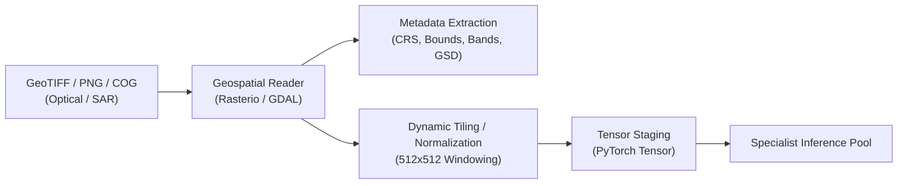
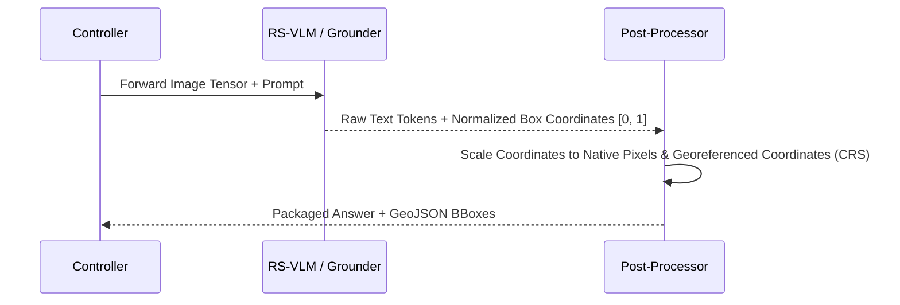
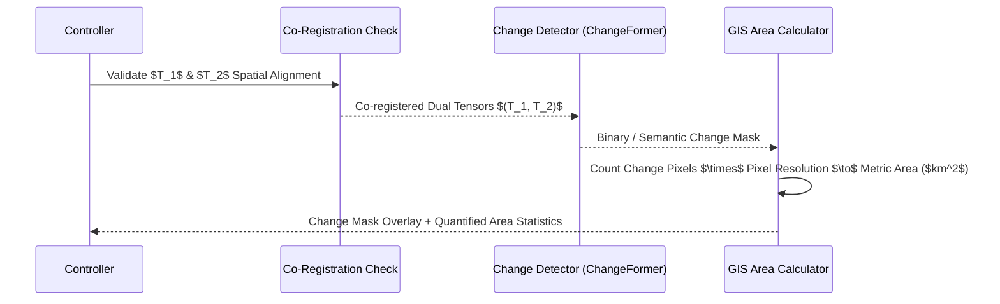

# Data Flow & Pipeline Architecture

This document describes the end-to-end data flow for multi-modal remote sensing ingestion, tensor conversion, inference streaming, and response delivery.

---

## 🌊 Ingestion & Preprocessing Pipeline



---

## 🔄 Execution Data Flow by Query Scenario

### 1. Single-Image VQA & Grounding Flow


### 2. Bi-Temporal Change Detection Flow


---

## 📦 Final Response Payload Schema

```json
{
  "query_id": "uuid-v4",
  "task_type": "change_detection_vqa",
  "answer": "Between 2022 and 2024, approximately 1.42 sq km of forest was cleared for urban construction in the north-western sector.",
  "confidence": 0.91,
  "visual_evidence": {
    "type": "change_mask",
    "mask_url": "/api/v1/artifacts/mask_123.png",
    "bounding_boxes": [
      {"label": "deforestation_zone", "bbox": [120, 45, 310, 220], "confidence": 0.93}
    ],
    "spatial_crs": "EPSG:32643",
    "metric_area_sq_km": 1.42
  },
  "execution_trace": [
    {"step": 1, "action": "parse_intent", "observation": "Bi-temporal change analysis requested"},
    {"step": 2, "action": "validate_rasters", "observation": "T1 and T2 CRS matched: EPSG:32643, GSD: 10m"},
    {"step": 3, "action": "run_changeformer", "observation": "Generated change mask with 14,200 positive pixels"},
    {"step": 4, "action": "compute_area", "observation": "Pixel area calculated as 1.42 sq km"},
    {"step": 5, "action": "synthesize_response", "observation": "Confidence calibrated to 0.91"}
  ]
}
```
