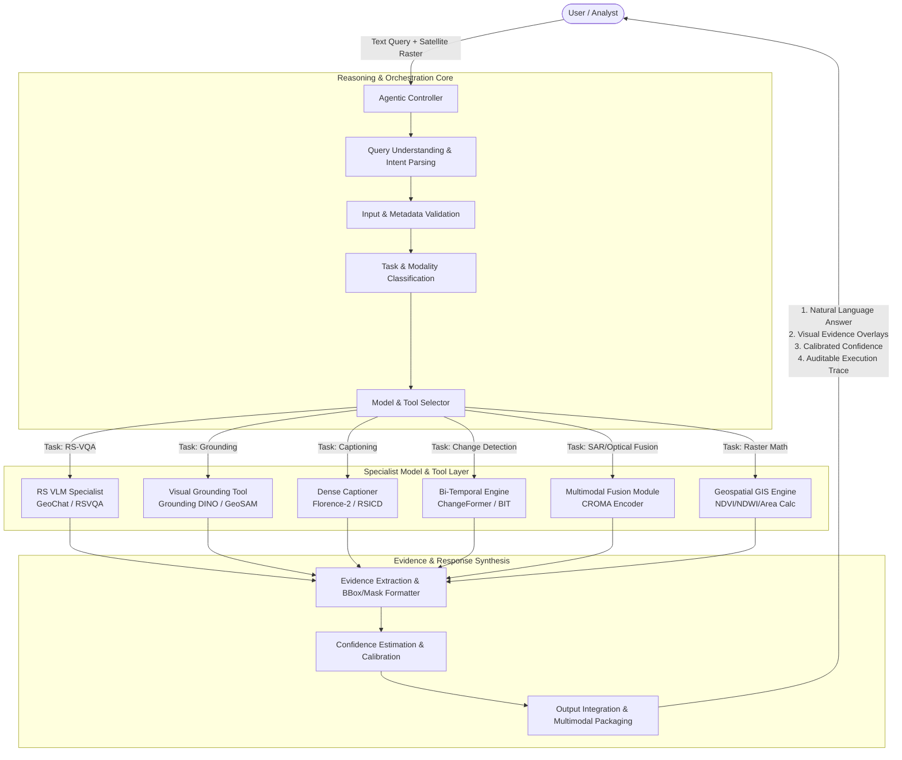

# System Architecture Design

## 🏛️ High-Level System Architecture

SatQuery AI is designed as a modular, agentic vision-language system that decouples conversational intent understanding from specialist remote sensing model execution.

---

## 🧩 Architectural Components

### 1. User Interface & API Gateway
- Ingests user natural language queries alongside single or multi-temporal geospatial rasters (GeoTIFF, COG, PNG).
- Provides streaming feedback and interactive geospatial map overlays.

### 2. Agentic Controller & Reasoning Core
- **Query Understanding**: Dissects natural language into atomic sub-intents (e.g. identify object, compare timestamps, compute area).
- **Input Validation**: Verifies raster validity, CRS, timestamp coherence, and channel counts.
- **Task Classification**: Maps intents to specific task categories (VQA, Grounding, Captioning, Change Detection, Fusion).
- **Model / Tool Selector**: Dispatches tasks to the optimal specialist model or deterministic geospatial calculation.

### 3. Specialist Model & Tool Execution Layer
- **RS-VQA Specialist**: Performs open-ended and factual visual question answering on single scenes.
- **Visual Grounding Tool**: Generates bounding boxes $[x_{min}, y_{min}, x_{max}, y_{max}]$ or segmentation masks.
- **Captioning Module**: Synthesizes rich descriptive scene summaries.
- **Bi-Temporal Change Engine**: Extracts difference features and produces binary/semantic change masks between $T_1$ and $T_2$.
- **Optical-SAR Fusion Module**: Fuses radar backscatter with multispectral bands for cloud-resilient analysis.
- **Geospatial GIS Engine**: Computes exact metric surface areas, bounding coordinates, and spectral indices (NDVI, NDWI).

### 4. Evidence Extraction & Confidence Calibration
- Translates model logits and attention maps into visual bounding boxes, polygon vectors, and saliency heatmaps.
- Computes calibrated confidence scores reflecting uncertainty across each reasoning step.

### 5. Response Integration & Trace Generator
- Assembles the final user response combining:
  - Formatted textual answer
  - Geospatial visual overlays (GeoJSON / PNG masks)
  - Numeric confidence rating
  - Step-by-step auditable execution trace
