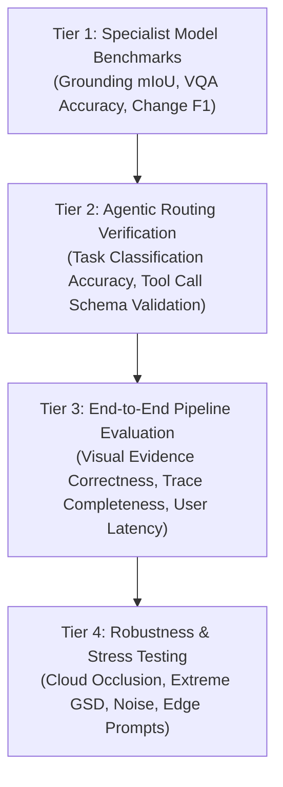

# Comprehensive Evaluation Strategy

This document outlines the systematic evaluation methodology for validating SatQuery AI across its components and end-to-end pipelines.

---

## 🎯 Multi-Tier Evaluation Protocol

---

## 📋 Evaluation Tiers

### Tier 1: Specialist Model Benchmarking
- Validate each model module independently against standardized academic test splits (VRSBench, RSVQA, CDVQA, BigEarthNet-MM).
- Establish baseline scores without the agentic wrapper.

### Tier 2: Agentic Routing & Tool Execution
- Formulate a test set of 200 diverse prompts (including ambiguous and multi-step queries).
- Measure **Router Accuracy**: Did the controller invoke the correct tool pipeline?
- Validate schema compliance for generated tool arguments.

### Tier 3: End-to-End Pipeline Performance
- Measure full turnaround time from prompt submission to response visualization.
- Verify visual evidence alignment (e.g. ensure bounding boxes match the entities described in text).
- Validate execution trace clarity and confidence calibration.

### Tier 4: Edge Cases & Robustness
- Stress test with noisy SAR speckle, cloud-covered optical tiles, extreme aspect ratios, and mismatched spatial coordinates.
