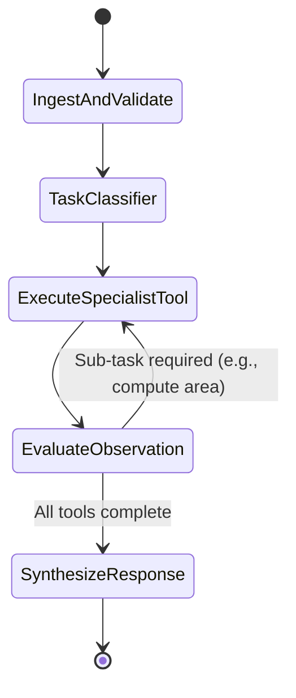

# Agent Orchestration Frameworks

This document explores agentic orchestration libraries and state graph architectures for managing the multi-step remote sensing analysis loop.

---

## 🧭 Framework Comparison

| Framework | Architecture Pattern | Strengths | Drawbacks | Recommendation |
| :--- | :--- | :--- | :--- | :--- |
| **LangGraph** | Cyclic Directed Acyclic Graph (DAG) with State Machine | Explicit state persistence, cyclic loops (ReAct/Reflection), branch routing. | Moderate learning curve. | ⭐ **Top Recommendation for complex agent loops** |
| **LlamaIndex Workflows** | Event-driven workflow | Excellent data index connectors, clean async event handlers. | Focuses more on RAG. | Strong alternative |
| **Custom Python State Machine** | Explicit async dispatch function | Zero external dependencies, 100% predictable execution trace. | Requires custom retry & validation logic. | ⭐ **Excellent for lightweight deterministic routing** |

---

## 🔄 State Graph Design (LangGraph Pattern)

---

## 🛠️ Tool Registry Specification
Each specialist tool is registered with strict JSON Schema typing:
- `tool_grounding(image_path: str, prompt: str, confidence_thresh: float) -> BBoxList`
- `tool_change_detection(t1_path: str, t2_path: str) -> ChangeMaskResult`
- `tool_spectral_index(image_path: str, index_type: str) -> RasterLayer`
- `tool_calculate_area(mask_path: str, crs: str) -> AreaMetric`
