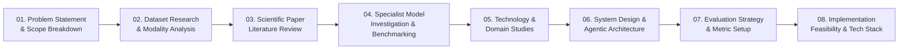

# SatQuery AI Research

> **Centralized Research, Documentation, Knowledge Base, and Reference Hub for SatQuery AI**

---

## 📌 Project Overview

| Attribute | Details |
| :--- | :--- |
| **Project Name** | **SatQuery AI** – An Interactive Vision-Language Assistant for Multimodal Remote Sensing Image Analysis through Text Queries |
| **Hackathon** | Smart India Hackathon (SIH) 2026 |
| **Problem Statement ID** | **26167** |
| **Organization** | **Indian Space Research Organisation (ISRO)** |
| **Category** | Software |
| **Theme** | Space Technology |

---

## 🎯 Purpose of This Repository

This repository is the dedicated **research and knowledge repository** for the SatQuery AI project. It houses all preliminary research, problem statement breakdowns, dataset benchmarks, scientific literature reviews, model architecture investigations, remote sensing domain knowledge, agentic design patterns, and evaluation frameworks.

> [!IMPORTANT]
> **This repository is NOT the main application/code repository.**
> No frontend, backend, or operational microservice application code is developed or stored here. This workspace serves strictly as our centralized technical knowledge base, system architecture blueprint, and research tracker.

---

## 📂 Repository Structure

| Directory | Purpose |
| :--- | :--- |
| [`01-Problem-Statement/`](01-Problem-Statement/README.md) | Official ISRO PS 26167 analysis, functional scope, query types, requirements, and evaluation guidelines. |
| [`02-SIH-Guidelines/`](02-SIH-Guidelines/README.md) | Smart India Hackathon guidelines, submission deliverables, judging criteria rubrics, and timeline. |
| [`03-Datasets/`](03-Datasets/README.md) | Documentation on remote sensing datasets (BigEarthNet, VRSBench, RSVQA, CDVQA) with metadata, modalities, and splits. |
| [`04-Research-Papers/`](04-Research-Papers/README.md) | Categorized reviews and literature summaries of key remote sensing VLM, VQA, captioning, and change detection papers. |
| [`05-Models/`](05-Models/README.md) | Deep-dive evaluations into specialist models across VQA, captioning, grounding, change detection, and multimodal fusion. |
| [`06-Technology/`](06-Technology/README.md) | Fundamental domain guides covering SAR, multispectral imaging, GeoTIFF geospatial standards, VLMs, and agentic workflows. |
| [`07-System-Design/`](07-System-Design/README.md) | Theoretical architecture, agentic orchestration loops, task routing, evidence grounding, and confidence estimation design. |
| [`08-Evaluation/`](08-Evaluation/README.md) | Evaluation strategy, benchmark metrics (BLEU, CIDEr, mIoU, F1, Accuracy), and verification test suites. |
| [`09-Implementation-Research/`](09-Implementation-Research/README.md) | Architecture feasibility research for UI/UX, backend services, geospatial engines, model serving, and deployment. |
| [`10-Team-Research/`](10-Team-Research/README.md) | Team meeting notes, research logs, architectural decision records (ADRs), exploratory ideas, and actionable TODOs. |
| [`References/`](References/README.md) | Curated links to official papers, datasets, pretrained models, developer tools, and ISRO/bhuvan/SAC portals. |

---

## 🛰️ Core Problem Requirements (PS 26167)

Based on the ISRO problem statement, SatQuery AI must address the following core functional capabilities:

1. **Single-Image Visual Question Answering (VQA)**:
   - Answering natural language queries regarding object counts, presence, spatial distribution, attributes, and terrain semantics on single remote sensing images.
2. **Text-Guided Grounding & Scene Captioning**:
   - Localizing described features (bounding boxes / masks) and generating rich descriptive captions for remote sensing scenes.
3. **Bi-Temporal Change Analysis**:
   - Comparing multi-temporal satellite imagery to identify, characterize, and localize surface changes over time.
4. **Change Description & Change-Based VQA**:
   - Answering complex questions about temporal differences (e.g., urban sprawl, deforestation, flood extents, infrastructure developments).
5. **Optical + SAR Cross-Modal Analysis**:
   - Integrating electro-optical (multispectral) and Synthetic Aperture Radar (SAR) imagery for all-weather, cross-sensor analysis and complementary feature extraction.
6. **Remote-Sensing Domain Adaptation**:
   - Handling domain-specific aspects: spatial resolution variations, multispectral bands beyond RGB, overhead bird's-eye viewpoints, scale variations, and dense clutter.
7. **Agentic Model & Tool Orchestration**:
   - Intelligent decomposition of free-form user queries, dynamic tool/model routing, multi-step reasoning, and pipeline execution.
8. **Evidence-Grounded Output**:
   - Providing visual evidence (bounding boxes, heatmaps, segmentation masks, change masks) alongside natural language responses.
9. **Confidence Information**:
   - Explicit confidence scoring or uncertainty calibration for model outputs to support critical decision-making.
10. **Auditable Execution Trace**:
    - Transparent step-by-step reasoning trace detailing how the agent decomposed the query, which tools were invoked, and intermediate findings.

---

## 🔬 Research Workflow

Our research progression follows an iterative, phased lifecycle:

---

## 🤝 Contribution Guidelines

All team members must follow the conventions defined in [`CONTRIBUTING.md`](CONTRIBUTING.md).
- Keep all documentation evidence-backed and strictly factual.
- Do not commit source code, heavy datasets, model weights, or private credentials to this repository.
- Use provided templates when documenting papers, models, and datasets.

---

## 🔗 References & Resources

Explore the [`References/`](References/README.md) directory for comprehensive indexes of:
- [Official Links](References/Official-Links.md)
- [Research Papers Index](References/Papers.md)
- [Datasets Index](References/Datasets.md)
- [Pretrained Models Index](References/Models.md)
- [Tools & Libraries Index](References/Tools.md)
